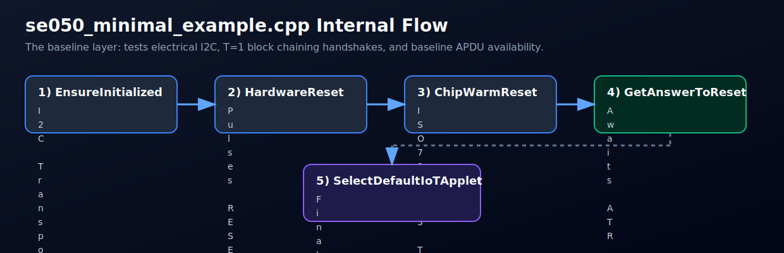
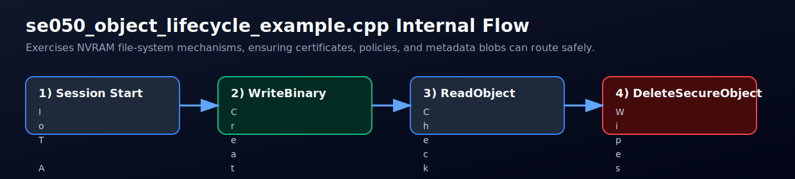
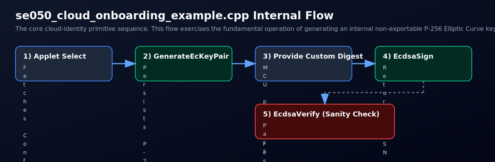
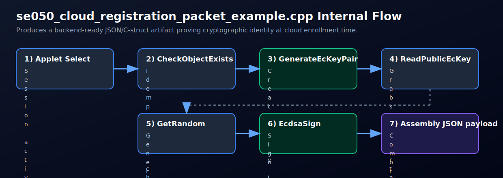

# Examples

| App | Description |
|-----|----------------|
| `se050_minimal_example` | Bring-up: reset + T=1 warm reset + GET ATR + SELECT applet |
| `se050_smoke_example` | Management smoke test: GetVersion/GetRandom/GetFreeMemory |
| `se050_object_lifecycle_example` | Binary object lifecycle: write/read/delete round-trip |
| `se050_cloud_onboarding_example` | Provisioning-style flow: EC keygen + ECDSA challenge sign/verify |
| `se050_cloud_registration_packet_example` | Registration payload flow: object-exists/create + pubkey + challenge signature |

Matrix and CI are driven by `examples/esp32/app_config.yml` and `hf-espidf-project-tools` scripts.

## Internal flow diagrams

### `se050_minimal_example`

What it does:

1. Brings up transport and optional reset.
2. T=1 warm reset and ATR fetch.
3. Applet select over APDU.

### `se050_smoke_example`

What it does:

1. Performs bring-up and ATR parsing.
2. Selects applet.
3. Runs management APDUs (version, random, free memory).

### `se050_object_lifecycle_example`

What it does:

1. Selects applet.
2. Writes binary object.
3. Reads back and verifies.
4. Deletes object.

### `se050_cloud_onboarding_example`

What it does:

1. Generates device keypair in SE050.
2. Signs onboarding digest in-chip.
3. Verifies signature in-chip as a sanity check.

### `se050_cloud_registration_packet_example`

What it does:

1. Checks if key object exists (idempotent provisioning).
2. Creates key if missing.
3. Reads public key material.
4. Builds challenge + signature artifacts for backend registration.

## Next reading

- [Security flows for IoT/OTA/comms](security_iot_ota_comms.md)
