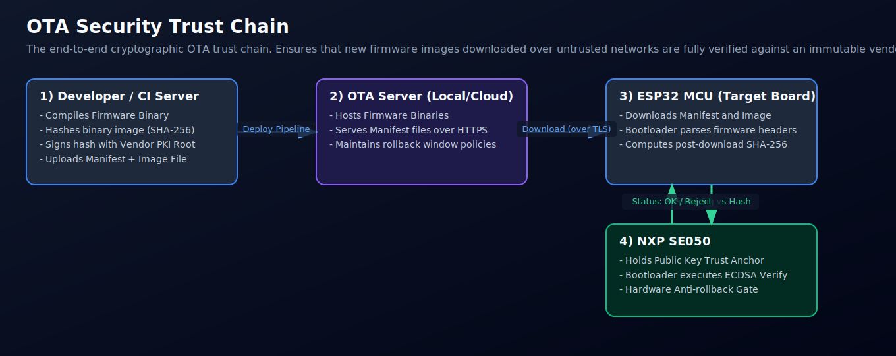

# Security flows with SE050 (easy-to-follow)

This page explains how to reason about security with this driver and how each example maps to real IoT deployment steps.

> Current driver status note: T=1/APDU/device APIs are implemented and usable; SCP03 secure messaging backend is still not enabled in the examples.

## Security goals (keep these separate)

1. **Device identity** — prove "this is my genuine board".
2. **Channel confidentiality + integrity** — protect data in transit.
3. **Software authenticity (OTA)** — only run vendor-signed firmware.
4. **Replay protection** — reject old valid packets/updates.

The SE050 helps most with (1) and key protection for (2)-(4): private keys never need to leave the secure element.

## Which approach for board-to-board comms?

For Ethernet (or any IP transport), the safest default is:

- **TCP + TLS** for stream connections.
- **UDP + DTLS** for datagrams.

Use app-layer crypto only when protocol constraints force you to (custom frames, very small stacks, legacy links).

## Ethernet implementation recipe (TLS-first)

Use this practical split:

1. **Provisioning time**
   - Create or inject device identity keypair in SE050.
   - Register public key (or certificate) with backend / peer trust store.
2. **Connection time**
   - Open TCP socket.
   - Start TLS handshake.
   - Require peer verification.
   - Use SE050-backed key operations for client identity proof.
3. **Data time**
   - Send payload through TLS write API only.
   - Receive via TLS read API only.

Pseudo-flow:

```text
tcp_connect(peer)
tls_configure(ca_store, client_identity)
tls_handshake()
while connected:
  tls_write(plaintext_payload)
  tls_read(plaintext_response)
```

Security rules:

- Reject invalid or expired peer certificate.
- Pin expected service identity (CN/SAN or key hash).
- Rotate credentials and support revocation.
- Do not bypass verification in development code paths.

### Recommended Ethernet pattern

1. Each board has a SE050-held device private key.
2. During provisioning, backend stores each board public key or certificate binding.
3. Board opens TLS to peer/service.
4. Handshake authenticates device identity (certificate/signature).
5. Session keys are negotiated ephemerally.
6. Application sends plaintext to TLS API; TLS handles encrypt/decrypt + authentication.


## OTA trust chain (practical)

Minimal robust OTA model:

1. Vendor signs firmware manifest/image offline (build system/HSM).
2. Device downloads over TLS.
3. Device verifies signature/hash before install.
4. Anti-rollback counter/version gate prevents downgrade.
5. Device boots only verified image.

SE050 roles:

- Store long-lived device identity keys.
- Optionally hold trust anchors or policy keys.
- Sign attestation/proof-of-state messages for fleet backend.



## App-layer encrypted packet model (when not using TLS)

If you must encrypt payloads yourself:

- Use **AES-GCM** (or ChaCha20-Poly1305).
- Unique nonce per message per key.
- Include counter + routing metadata in AAD.
- Add replay window check on receiver.

Packet concept:

`{version, key_id, counter, nonce, aad, ciphertext, tag, optional_signature}`


Minimal sender/receiver logic:

```text
sender:
	counter++
	nonce = unique_per_message()
	ciphertext, tag = AES_GCM_Encrypt(key, nonce, aad={counter,route}, plaintext)
	packet = {key_id,counter,nonce,ciphertext,tag}

receiver:
  verify_counter_is_fresh(counter)
  plaintext = AES_GCM_Decrypt_And_Verify(key, nonce, aad, ciphertext, tag)
  reject_on_any_auth_failure()
```

Critical pitfalls to avoid:

- Never reuse nonce with same key.
- Never accept packet when GCM tag check fails.
- Never use ECB/CBC without robust MAC design.
- Never skip replay-window enforcement.


## How current examples map to deployment steps

### 1) `se050_minimal_example`

- Verifies electrical + T=1 link health.
- Retrieves ATR profile and selects IoT applet.
- Use this first on new hardware.

### 2) `se050_smoke_example`

- Queries applet version/capabilities, random, free memory.
- Use this to baseline chip readiness and diagnostics.

### 3) `se050_object_lifecycle_example`

- Demonstrates secure object write/read/delete path.
- Foundation for certificate blobs, policy objects, or metadata slots.

### 4) `se050_cloud_onboarding_example`

- Generates EC keypair in-chip and signs onboarding digest.
- Shows identity proof primitive for registration.

### 5) `se050_cloud_registration_packet_example`

- Idempotent key handling + public key extraction + challenge signature.
- Produces backend-facing registration fields.

## Security checklist for production

- Never export long-term private keys from SE050.
- Prefer TLS/DTLS over custom crypto on Ethernet links.
- Bind every packet/update to freshness (counter/nonce/version).
- Enforce key rotation and revocation policy server-side.
- Log security events (failed signature, rollback attempt, stale counter).
- Keep boot + OTA verification chain independent from runtime comms policy.
